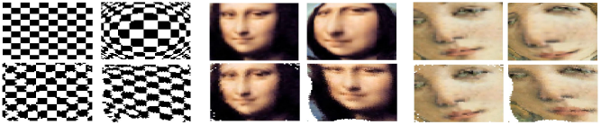

# Unsupervised Model-Free Camera Calibration

MATLAB implementation of the displacement-based camera calibration algorithm from:

> **Unsupervised model-free camera calibration algorithm for robotic applications**
> Guglielmo Montone, J. Kevin O'Regan, Alexander V. Terekhov
> *IROS 2015*

## Overview

This repository implements a completely unsupervised, model-free algorithm for camera calibration. Unlike traditional techniques, it requires:

- **No calibration pattern** (checkerboard, etc.)
- **No camera model** — works for pin-hole, fish-eye, and other optical devices
- **No human supervision** — the robot calibrates itself by moving

The algorithm is inspired by developmental robotics research on how a naïve agent can discover the spatial layout of its sensors. It exploits a fundamental property of rigid displacements: when a camera moves, the input sensed by photoreceptor *i* before the displacement will be sensed by photoreceptor *j* after it — regardless of the scene content. By collecting these couplings across many movements, the algorithm recovers the 2D layout of the photoreceptor grid.

This approach (the *displacement-based* algorithm) outperforms the main prior unsupervised method (Kuipers' correlation-based algorithm), particularly for large photoreceptor grids where Kuipers' dissimilarity measure saturates and becomes distance-independent.

## Algorithm

**Step 1 — φ function evaluation.**
For each camera displacement *d*, the algorithm associates each photoreceptor *i* with the photoreceptor *j* whose input sequence is maximally correlated with *i*'s input before the displacement. This bijective map φ_d captures which photoreceptors "see the same thing" before and after the movement.

**Step 2 — Distance matrix.**
A dissimilarity metric µᴰ(i, j) is computed from the set of φ functions: two photoreceptors are more dissimilar if they are coupled by a large-displacement φ function. This metric grows monotonically with true photoreceptor separation, unlike Kuipers' µᶜ which saturates at large distances.

**Step 3 — Manifold unfolding.**
Multidimensional Scaling (MDS, CMDS, or CCA) is applied to the distance matrix to recover the estimated 2D coordinates of each photoreceptor.

**Step 4 — Image undistortion.**
The estimated photoreceptor layout is used to remap distorted (e.g., fish-eye) images back to a rectilinear view.

## Results

Fish-eye images before and after calibration (photoreceptor grid size 70, no displacement error):



*Left column: original scene. Center: raw fish-eye image. Bottom-left: undistorted with displacement-based method. Bottom-right: undistorted with correlation-based method.*

The mean scaled relative error (MSRE) of the displacement-based method is ≤ 0.7 pixels for grids up to size 50, even with 10% Gaussian noise on camera displacements (see Table I in the paper).

## Repository Structure

```
cameraCalibration/
├── CreateRetina/           Define the photoreceptor grid
│   ├── defineFictionRetinaSquare.m   Square grid
│   ├── defineFictionRetinaCircle.m   Circular grid
│   └── createRetinaTest.m            Usage example
│
├── LoadImages/             Create or load image datasets
│   ├── createFakeImageDataset.m      Generate synthetic dataset (entry point)
│   └── createDatasetFromRawData.m    Load real robot images
│
├── RetinaTopology/         Core calibration algorithm
│   ├── estimMetricRetina.m           Run calibration (entry point)
│   ├── estimTopolCord.m              Manifold unfolding (MDS/CMDS/CCA)
│   └── evalMultPhiFun.m              φ function evaluation
│
└── CalibImg/               Apply calibration to images
    └── undistortImg.m                Undistort a fish-eye image (entry point)
```

## Requirements

- MATLAB
- Statistics and Machine Learning Toolbox (for MDS/CMDS)
- Image Processing Toolbox

## Getting Started

**1. Generate a synthetic dataset**

```matlab
cd LoadImages/
createFakeImageDataset   % saves FakeGrayScaleImgFishEye.mat
```

**2. Run the calibration**

```matlab
cd RetinaTopology/
estimMetricRetina        % saves retina structure with distance matrix
estimTopolCord           % (optional) unfold manifold to get tp_estim
```

**3. Undistort an image**

```matlab
cd CalibImg/
undistortImg             % loads fish-eye image and retina, shows result
```

## Key Parameters

Edit these at the top of `RetinaTopology/estimMetricRetina.m`:

| Parameter | Default | Description |
|-----------|---------|-------------|
| `square_retina` | `1` | `1` = square grid, `0` = circular grid |
| `retina_size` | `150` | Number of photoreceptors per grid side |
| `retina_step` | `2` | Spacing between photoreceptors (pixels) |
| `corr_threshold` | `0.9` | Minimum correlation to accept a φ mapping |
| `ray` | `110` | Radius for circular retina (pixels) |

In `LoadImages/createFakeImageDataset.m`:

| Parameter | Default | Description |
|-----------|---------|-------------|
| `numEnv` | `40` | Number of random environments |
| `numMov` | `60` | Number of camera movements per environment |
| `dim_data_pic` | `[150 150]` | Image resolution (pixels) |

## Using Real Robot Data

To calibrate with images captured by a real robot, use `createDatasetFromRawData.m`:

```matlab
% Provide the folder containing the robot's images
dataset = createDatasetFromRawData('path/to/robot/images/');
```

The function converts the raw images into the `.mat` format expected by `estimMetricRetina`.

## Citation

```bibtex
@inproceedings{montone_unsupervised,
  title     = {Unsupervised model-free camera calibration algorithm for robotic applications},
  author    = {Montone, Guglielmo and O'Regan, J. Kevin and Terekhov, Alexander V.},
  booktitle = {IEEE/RSJ International Conference on Intelligent Robots and Systems (IROS)},
  year      = {2015}
}
```

## License

See [LICENSE](LICENSE).
